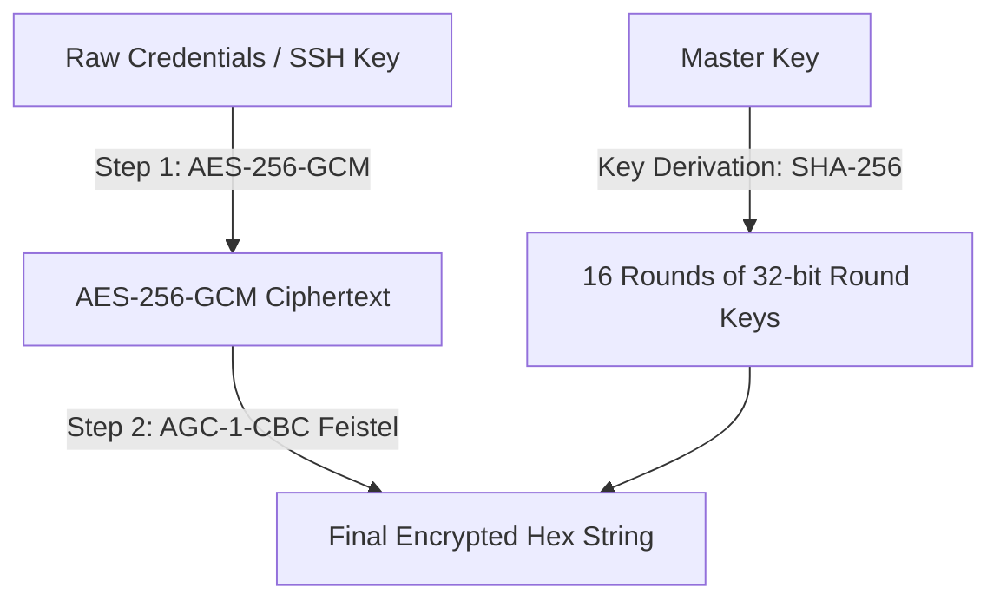

# VPSMonitor — System & Client Monitoring Suite

Welcome to **VPSMonitor**, a secure, lightweight, and modern server resource monitoring ecosystem. The suite consists of a Node.js/Express-based central monitoring server/dashboard and an optimized, secure Kotlin Android Client.

---

## 🏗️ System Architecture

The VPSMonitor ecosystem is split into two major components:

1. **VPSMonitor Backend & Web Dashboard (`/src`, `/public`)**
   - **Backend**: Node.js, Express, and SQLite3 database for persisting server information.
   - **Worker Engine**: Periodically polls registered server nodes via SSH, parses system resources (CPU, RAM, Disk, Uptime, Temperature, Network Packets, Processes), and persists metrics.
   - **Communication**: WebSockets (`ws`) for pushing real-time performance metrics directly to the Web Dashboard.
   - **Frontend**: A vanilla HTML5/CSS3/JavaScript SPA utilizing premium aesthetics, dark themes, and smooth interactive elements.

2. **VPSMonitor Kotlin Android Client (`/android-client`)**
   - Built entirely in **Kotlin** and **Jetpack Compose**.
   - Direct connection to servers via SSH/SFTP (bypassing any third-party clouds).
   - Features built-in secure credentials vaults, real-time Canvas charts, a custom file manager with built-in code editor, a custom interactive Terminal, and local network device scanner.

---

## 🔒 Security & Cryptographic Schemes (OPSec 2026)

VPSMonitor has been designed with rigorous security standards to prevent data leakage and connection sniffing.

### 🛡️ Backend Cryptography: AGC-1 (AntiGravity Cipher v1)
All sensitive credential fields stored in the SQLite database (such as host credentials, SSH keys, and passphrases) are encrypted using **AGC-1**, a custom double-envelope encryption architecture:



- **Two-Layer Protection**: First, raw text is encrypted with standard **AES-256-GCM** to ensure cryptographically secure confidentiality and authentication tags. Second, the ciphertext is encrypted using **AGC-1-CBC** (a custom 16-round Feistel Network block cipher).
- **Zero Raw Storage**: Prevents direct credential extraction even if the SQLite database file (`vps_monitor.db`) is leaked or compromised.
- For complete formulas, Feistel structure details, and round function operations, refer to [AGC_DESIGN.md](file:///f:/VPSMonitor/AGC_DESIGN.md).

### 📱 Android Client Hardening
- **Anti-Screen Capture/Screencast**: The client uses `FLAG_SECURE` to block screenshots, video recordings, and screen mirroring, shielding sensitive SSH passwords and key files.
- **Hardware-Backed Encryption**: Utilizes `EncryptedSharedPreferences` integrated with the Android Keystore system. Credentials are saved locally inside an AES-256-GCM hardware vault.
- **Auto-Migration Pipeline**: Plaintext preferences from legacy clients are automatically decrypted and moved to the secure hardware storage container on the first startup.
- **APK Integrity Verification**: Computes the SHA-256 signature of the running APK and displays it within the sidebar for easy manual validation, preventing tampered/re-packaged APK builds.
- **Strict Host Key Checking**: Offers MitM (Man-in-the-Middle) protection by verifying SSH server fingerprints against known host keys.

---

## 📱 Android Client Features

The Kotlin Compose client includes several premium features designed for system administrators:

- **📊 Real-time Dashboard**: Smoothly rendering CPU, Memory, and Disk curves using custom Canvas API drawing. Provides immediate process management and network statistics.
- **📁 SFTP Explorer**: A tree-style file explorer with a built-in **Code Editor** that features custom line numbering gutters and complete Undo/Redo stacks for remote configuration edits.
- **💻 SSH Terminal**: A responsive remote console equipped with a custom accessory keyboard bar (shortcuts for `Esc`, `Tab`, `Ctrl`, `Alt`, etc.) and history command buffers.
- **🌐 Subnet Scanner**: Sweeps the local subnet area network via ping & port checks (22/80/443) to quickly locate and connect local server nodes.

---

## 🚀 Getting Started

### 1. Prerequisites
- **Node.js**: v18 or later.
- **JDK / Android SDK**: For compiling the Android client.

### 2. Running the Node.js Server & Web Dashboard
```bash
# 1. Install Node.js dependencies
npm install

# 2. Start the development server
npm start
```
The server will start on port `3000`. Open `http://localhost:3000` to access the Web Dashboard.

### 3. Compiling the Standalone Server (Windows EXE)
The project supports compilation into a single, self-contained Windows executable (`vpsmonitor.exe`) that embeds the node runtime and frontend assets:
```bash
# Compile and package the app
npm run build:exe
```
The output executable will be created in `dist/vpsmonitor.exe`. 
> 💡 *Note: The native SQLite3 library remains external and must reside next to the executable if distributed.*

### 4. Building the Android Client
Open the `android-client` folder or import it into Android Studio:
```bash
# Navigate to the Android project root
cd android-client

# Compile a Debug APK
./gradlew assembleDebug
```
The compiled APK will be available in `app/build/outputs/apk/debug/app-debug.apk`.
